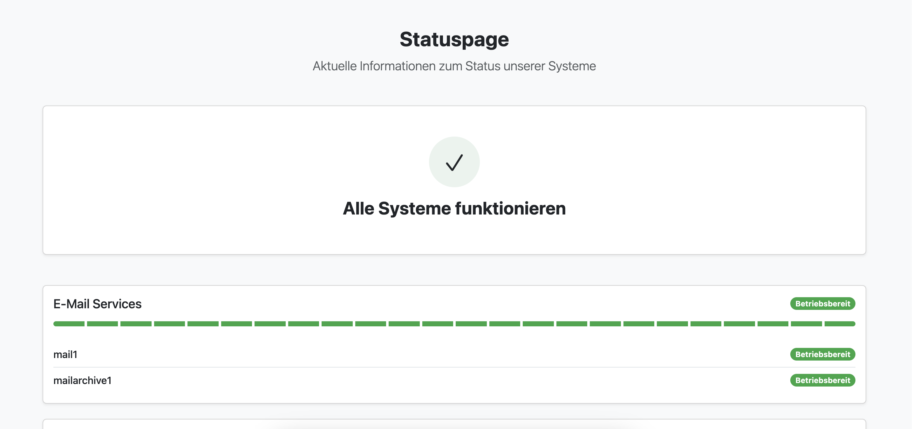

# 🚦 Statuspage

[](https://php.net)
[](https://opensource.org/licenses/MIT)
[](http://makeapullrequest.com)

Eine professionelle, PHP-basierte Statuspage zur Anzeige des Systemstatus und zur Verwaltung von Störungsmeldungen. Ideal für Unternehmen, die ihren Kunden transparente Informationen über den Zustand ihrer Dienste bieten möchten.



## ✨ Hauptfunktionen

🔧 **Admin-Dashboard**
- Umfassender Admin-Bereich zum Verwalten von Hostgruppen und Hosts
- Intuitive Benutzeroberfläche für effizientes Management

🚨 **Incident Management**
- Professionelle Verwaltung von Störungsmeldungen
- Detaillierte Verlaufsansicht und Statusupdates

📧 **Benachrichtigungen**
- Automatische E-Mail-Benachrichtigungen bei Störungen
- Anpassbare E-Mail-Templates

🎨 **Anpassbares Design**
- Logo-Upload Funktion
- Flexibles Farbschema
- Responsive Design für alle Geräte

💾 **Einfache Wartung**
- SQLite-Datenbank ohne zusätzliche Server
- Automatische Backups
    

## 🚀 Installation

### Voraussetzungen

- Debian/Ubuntu Server mit Root-Zugriff
- Öffentlich erreichbare Domain(s)

### Schnellinstallation

1. **Installer-Skript herunterladen**
   ```bash
   nano install.sh
   ```
   Folgenden Inhalt in die Datei kopieren:
   ```
   #!/bin/bash
   # Installer-Skript für die Statuspage

   # Sicherstellen, dass das Skript als Root ausgeführt wird.
   if [[ "$EUID" -ne 0 ]]; then
   echo "Dieses Skript muss als Root ausgeführt werden. Bitte mit sudo starten."
   exit 1
   fi

   # Funktion zum Erkennen des Webservers
   detect_webserver() {
   if systemctl is-active --quiet apache2; then
      echo "apache2"
   elif systemctl is-active --quiet nginx; then
      echo "nginx"
   else
      echo "none"
   fi
   }

   # Funktion zum Ermitteln des PHP-FPM-Service-Namens
   detect_php_fpm() {
   for version in 8.2 8.1 8.0 7.4 7.3 7.2; do
      if systemctl is-active --quiet php$version-fpm; then
         echo "php$version-fpm"
         return
      fi
   done
   echo "none"
   }

   echo "Aktualisiere Paketliste..."
   apt-get update -y

   echo "Installiere erforderliche Pakete: git, php, php-sqlite3, curl, certbot, composer"
   apt-get install -y git php php-sqlite3 curl certbot composer php-xml php-mbstring unzip

   # Domains abfragen
   read -rp "Bitte geben Sie die Domains ein, die auf die Statuspage zeigen sollen (getrennt durch Leerzeichen): " domains

   # Abfrage, ob Let's Encrypt Zertifikate erstellt werden sollen
   read -rp "Sollen Let's Encrypt Zertifikate für die angegebenen Domains erstellt werden? [y/n]: " create_certs

   if [[ $create_certs =~ ^[Yy]$ ]]; then
   echo "Erstelle Let's Encrypt Zertifikate für die Domains: $domains"
   
   # Webserver erkennen
   WEBSERVER=$(detect_webserver)
   
   if [ "$WEBSERVER" != "none" ]; then
      echo "Webserver $WEBSERVER erkannt. Dieser muss temporär gestoppt werden, um Port 80 freizugeben."
      read -rp "Webserver temporär stoppen, um Zertifikate zu erstellen? [y/n]: " stop_webserver
      
      if [[ $stop_webserver =~ ^[Yy]$ ]]; then
         echo "Stoppe $WEBSERVER temporär..."
         systemctl stop "$WEBSERVER"
      else
         echo "Zertifikatserstellung wird übersprungen, da der Webserver nicht gestoppt werden soll."
         create_certs="n"
      fi
   fi
   
   if [[ $create_certs =~ ^[Yy]$ ]]; then
      # Zusammenbauen der -d Parameter für certbot
      domains_arg=""
      for domain in $domains; do
         domains_arg="$domains_arg -d $domain"
      done
      
      # Zertifikate über den Standalone-Modus abrufen
      certbot certonly --standalone $domains_arg
      
      # Webserver wieder starten, falls er gestoppt wurde
      if [ "$WEBSERVER" != "none" ] && [[ $stop_webserver =~ ^[Yy]$ ]]; then
         echo "Starte $WEBSERVER wieder..."
         systemctl start "$WEBSERVER"
      fi
   fi
   fi

   # Zielverzeichnis des Webservers festlegen
   if [ "$WEBSERVER" == "apache2" ]; then
   WEB_DIR="/var/www/html/status"
   elif [ "$WEBSERVER" == "nginx" ]; then
   WEB_DIR="/var/www/status"
   else
   WEB_DIR="/var/www/status"
   fi

   echo "Repository klonen..."
   git clone https://github.com/Gilt22/status.git /tmp/status-repo

   echo "Erstelle Webserver-Verzeichnis: $WEB_DIR"
   mkdir -p "$WEB_DIR"

   echo "Kopiere Dateien in das Webserver-Verzeichnis..."
   cp -r /tmp/status-repo/* "$WEB_DIR"
   cp -r /tmp/status-repo/.* "$WEB_DIR" 2>/dev/null || true

   # Ermittle den Webserver-Benutzer
   if [ "$WEBSERVER" == "apache2" ] || [ "$WEBSERVER" == "nginx" ]; then
   WEB_USER="www-data"
   WEB_GROUP="www-data"
   else
   # Fallback auf einen Standard-Benutzer
   WEB_USER="www-data"
   WEB_GROUP="www-data"
   fi

   # Erstelle die Datenbankverzeichnisse mit korrekten Berechtigungen
   echo "Erstelle Datenbankverzeichnis mit korrekten Berechtigungen..."
   mkdir -p "$WEB_DIR/database"
   touch "$WEB_DIR/database/status.db"  # Erstelle eine leere Datenbankdatei
   chown -R "$WEB_USER:$WEB_GROUP" "$WEB_DIR/database"
   chmod -R 775 "$WEB_DIR/database"

   # Erstelle das Verzeichnis für Uploads mit korrekten Berechtigungen
   echo "Erstelle Upload-Verzeichnis mit korrekten Berechtigungen..."
   mkdir -p "$WEB_DIR/assets/img"
   chown -R "$WEB_USER:$WEB_GROUP" "$WEB_DIR/assets/img"
   chmod -R 775 "$WEB_DIR/assets/img"

   # Setze Berechtigungen für das gesamte Verzeichnis
   echo "Setze Berechtigungen für das gesamte Verzeichnis..."
   chown -R "$WEB_USER:$WEB_GROUP" "$WEB_DIR"
   find "$WEB_DIR" -type d -exec chmod 755 {} \;
   find "$WEB_DIR" -type f -exec chmod 644 {} \;

   # composer Install ausführen
   echo "Führe 'composer install' im Verzeichnis $WEB_DIR aus..."
   cd "$WEB_DIR" || { echo "Fehler: Verzeichnis $WEB_DIR nicht gefunden!"; exit 1; }
   composer install

   # Aufräumen
   rm -rf /tmp/status-repo

   # Webserver-Konfiguration erstellen
   if [ "$WEBSERVER" == "apache2" ]; then
   # Erste Domain für die Konfiguration verwenden
   first_domain=$(echo $domains | cut -d' ' -f1)
   
   echo "Erstelle Apache-Konfiguration für $first_domain..."
   cat > "/etc/apache2/sites-available/status.conf" << EOF
   <VirtualHost *:80>
      ServerName $first_domain
      DocumentRoot $WEB_DIR
      
      <Directory $WEB_DIR>
         Options -Indexes +FollowSymLinks
         AllowOverride All
         Require all granted
      </Directory>
      
      ErrorLog \${APACHE_LOG_DIR}/status-error.log
      CustomLog \${APACHE_LOG_DIR}/status-access.log combined
   </VirtualHost>
   EOF

   # Wenn Let's Encrypt Zertifikate erstellt wurden, HTTPS-Konfiguration hinzufügen
   if [[ $create_certs =~ ^[Yy]$ ]]; then
      cat > "/etc/apache2/sites-available/status-ssl.conf" << EOF
   <VirtualHost *:443>
      ServerName $first_domain
      DocumentRoot $WEB_DIR
      
      <Directory $WEB_DIR>
         Options -Indexes +FollowSymLinks
         AllowOverride All
         Require all granted
      </Directory>
      
      ErrorLog \${APACHE_LOG_DIR}/status-error.log
      CustomLog \${APACHE_LOG_DIR}/status-access.log combined
      
      SSLEngine on
      SSLCertificateFile /etc/letsencrypt/live/$first_domain/fullchain.pem
      SSLCertificateKeyFile /etc/letsencrypt/live/$first_domain/privkey.pem
   </VirtualHost>
   EOF

      # SSL-Modul aktivieren
      a2enmod ssl
   fi
   
   # Aktiviere die Konfiguration und rewrite-Modul
   a2enmod rewrite
   a2ensite status.conf
   if [[ $create_certs =~ ^[Yy]$ ]]; then
      a2ensite status-ssl.conf
   fi
   
   # Apache neu starten
   systemctl restart apache2

   elif [ "$WEBSERVER" == "nginx" ]; then
   # Erste Domain für die Konfiguration verwenden
   first_domain=$(echo $domains | cut -d' ' -f1)
   
   # PHP-FPM-Service ermitteln
   PHP_FPM=$(detect_php_fpm)
   if [ "$PHP_FPM" == "none" ]; then
      PHP_FPM="php7.4-fpm"  # Fallback
   fi
   
   # PHP-Version aus dem Service-Namen extrahieren
   PHP_VERSION=$(echo "$PHP_FPM" | sed 's/php\(.*\)-fpm/\1/')
   
   echo "Erstelle Nginx-Konfiguration für $first_domain mit PHP $PHP_VERSION..."
   cat > "/etc/nginx/sites-available/status" << EOF
   server {
      listen 80;
      server_name $first_domain;
      root $WEB_DIR;
      index index.php;

      location / {
         try_files \$uri \$uri/ /index.php?\$query_string;
      }

      location ~ \.php$ {
         include snippets/fastcgi-php.conf;
         fastcgi_pass unix:/var/run/php/php$PHP_VERSION-fpm.sock;
      }

      location ~ /\.ht {
         deny all;
      }
   }
   EOF

   # Wenn Let's Encrypt Zertifikate erstellt wurden, HTTPS-Konfiguration hinzufügen
   if [[ $create_certs =~ ^[Yy]$ ]]; then
      cat > "/etc/nginx/sites-available/status-ssl" << EOF
   server {
      listen 443 ssl;
      server_name $first_domain;
      root $WEB_DIR;
      index index.php;

      ssl_certificate /etc/letsencrypt/live/$first_domain/fullchain.pem;
      ssl_certificate_key /etc/letsencrypt/live/$first_domain/privkey.pem;

      location / {
         try_files \$uri \$uri/ /index.php?\$query_string;
      }

      location ~ \.php$ {
         include snippets/fastcgi-php.conf;
         fastcgi_pass unix:/var/run/php/php$PHP_VERSION-fpm.sock;
      }

      location ~ /\.ht {
         deny all;
      }
   }
   EOF
   fi
   
   # Aktiviere die Konfiguration
   ln -sf /etc/nginx/sites-available/status /etc/nginx/sites-enabled/
   if [[ $create_certs =~ ^[Yy]$ ]]; then
      ln -sf /etc/nginx/sites-available/status-ssl /etc/nginx/sites-enabled/
   fi
   
   # Nginx neu starten
   systemctl restart nginx
   fi

   # Überprüfe, ob die Datenbank korrekt erstellt wurde
   echo "Überprüfe Datenbankberechtigungen..."
   if [ -f "$WEB_DIR/database/status.db" ]; then
   echo "Datenbank existiert, setze Berechtigungen..."
   chown "$WEB_USER:$WEB_GROUP" "$WEB_DIR/database/status.db"
   chmod 664 "$WEB_DIR/database/status.db"
   else
   echo "Erstelle leere Datenbank..."
   touch "$WEB_DIR/database/status.db"
   chown "$WEB_USER:$WEB_GROUP" "$WEB_DIR/database/status.db"
   chmod 664 "$WEB_DIR/database/status.db"
   fi

   # Setze Berechtigungen für das Verzeichnis erneut, um sicherzustellen, dass alles korrekt ist
   chown -R "$WEB_USER:$WEB_GROUP" "$WEB_DIR"
   chmod -R 755 "$WEB_DIR"
   chmod -R 775 "$WEB_DIR/database"
   chmod -R 775 "$WEB_DIR/assets/img"

   # Erfolgsmeldung
   first_domain=$(echo $domains | cut -d' ' -f1)
   echo "-------------------------------------------------"
   echo "Installation abgeschlossen!"
   if [[ $create_certs =~ ^[Yy]$ ]]; then
   echo "Die Statuspage ist nun unter https://$first_domain/ erreichbar und kann über das Webscript fertig installiert werden."
   else
   echo "Die Statuspage ist nun unter http://$first_domain/ erreichbar und kann über das Webscript fertig installiert werden."
   fi
   echo "-------------------------------------------------"
   ```

2. **Skript ausführbar machen**
   ```bash
   chmod +x install.sh
   ```

3. **Installation starten**
   ```bash
   ./install.sh
   ```

4. **Konfiguration durchführen**
   - Domains eingeben
   - SSL-Zertifikate einrichten (optional)
   - Web-Installer durchlaufen

Detaillierte Installationsanweisungen finden Sie in der [Installationsanleitung](docs/INSTALL.md).
    

## 🛠 Konfiguration & Nutzung

### Admin-Bereich

Der Admin-Bereich bietet folgende Funktionen:

- **Dashboard**: Übersicht über Hostgruppen, Hosts und aktuelle Störungen
- **Hostgruppen**: Verwaltung von logischen Gruppen für Ihre Dienste
- **Hosts**: Verwaltung einzelner Komponenten und deren Status
- **Störungen**: Erstellung und Verwaltung von Störungsmeldungen
- **E-Mail-Einstellungen**: Konfiguration der E-Mail-Parameter
- **Website-Einstellungen**: Anpassung von Logo, Farben und Firmeninformationen

### Öffentliche Seite

- 📊 Übersichtliche Statusanzeige aller Komponenten
- 📜 Detaillierte Störungshistorie
- 📧 E-Mail-Benachrichtigungen für Statusupdates

## 🔒 Sicherheit

- Regelmäßige Updates durchführen
- HTTPS-Verschlüsselung verwenden
- Starke Passwörter nutzen
- Backups der SQLite-Datenbank erstellen

## 🤝 Mitwirken

Beiträge sind willkommen! So können Sie helfen:

- 🐛 Fehler melden
- 💡 Neue Funktionen vorschlagen
- 📝 Dokumentation verbessern
- 🔧 Pull Requests einreichen

## 📄 Lizenz

Dieses Projekt steht unter der [MIT-Lizenz](LICENSE).